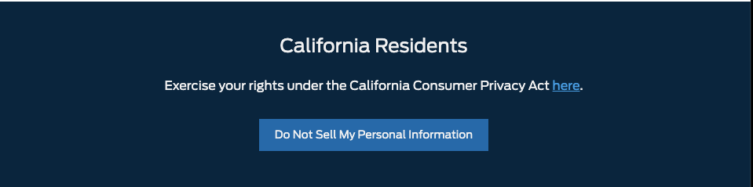

# California Privacy Banner


## Install:


```bash
$ yarn add https://github.com/latitude-digital/react-ford-ccpa-banner
```

## Development:
- make changes
- run `npm run build`
- then push em up
